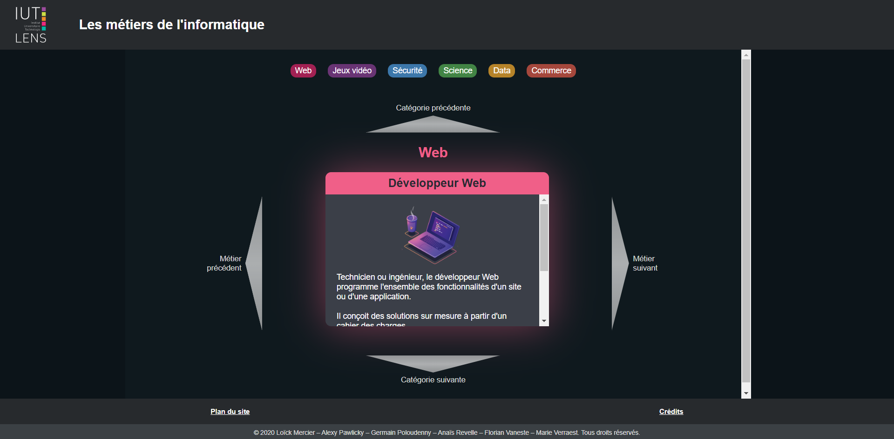

# Les métiers de l'informatique (website)

Aperçu du site :  
https://florianvaneste.github.io/Les-metiers-de-l-informatique--Website/

---

## Présentation du site

Le but de notre site est de donner une vue générale sur les métiers de l'informatique.

Nous avons donc cherché à donner les informations essentielles pour chaque métier, de manière synthétique.

 

## Interface et hierarchisation des informations

Pour rendre notre site plus interactif, nous avons voulu intégrer un système de cartes présentant chaque métier.

Nous les avons ensuite regroupées par catégories :
- Web
- Jeux vidéo
- Sécurité
- Science
- Data
- Commerce

Pour naviguer facilement entre les catégories et les cartes, nous avons ajouté des boutons précédent et suivant.

Nous avons aussi ajouté des boutons pour accéder directement à chaque catégorie. L'utilisateur n'a alors plus besoin de cliquer plusieurs fois pour y accéder. Un seul clic suffit désormais.  

 

## Choix techniques et de design

Nous avons cherché à créer une interface "mobile friendly", qui soit pratique à utiliser sur écran tactile ou non. C'est pourquoi l'ensemble des éléments de la page sont placés sur le centre de l'écran.

Nous avons volontairement limité la largeur des cartes même sur grand écran. Si nous ne l'avions pas fait, la carte aurait été trop large proportionnellement au contenu.

Pour réaliser notre site nous n'avons utilisé aucun framework. Pour la mise en page, les propriétés css flexbox et les unités relatives au viewport (vw et vh) nous semblaient largement suffisantes, et ne nécéssitaient pas d'importer une bibliothèque complète. Cela aurait eu un impact négatif sur la vitesse de chargement de la page.

Pour le système de gestion de cartes, nous avons voulu faire notre propre code avec javascript. Utiliser une librairie de caroussel n'aurait pas été adapté puisque le nôtre est en deux dimensions. De plus, l'implémentation des boutons de navigation vers chaque catégorie aurait été plus compliquée avec un framework.

Concernant le design, nous avons attribué une couleur à chaque catégorie afin de donner des repères à l'utilisateur. Cela permet aussi de garder une certaine cohérence dans le design.

 

## Choix du contenu et répartition

Nous avions déjà réalisé des travaux de recherche sur l'ensemble des métiers de l'informatique et en avions fait des affiches. Le contenu nous semblait pertinent et adapté à ce projet.

Nous avons donc repris ce contenu et l'avons adapté pour le web.

Les informations clé de chaque métier (salaire, formation...) ont été mises en valeur en bas de chaque carte afin que ces informations soit facilement visibles sur chaque carte.
